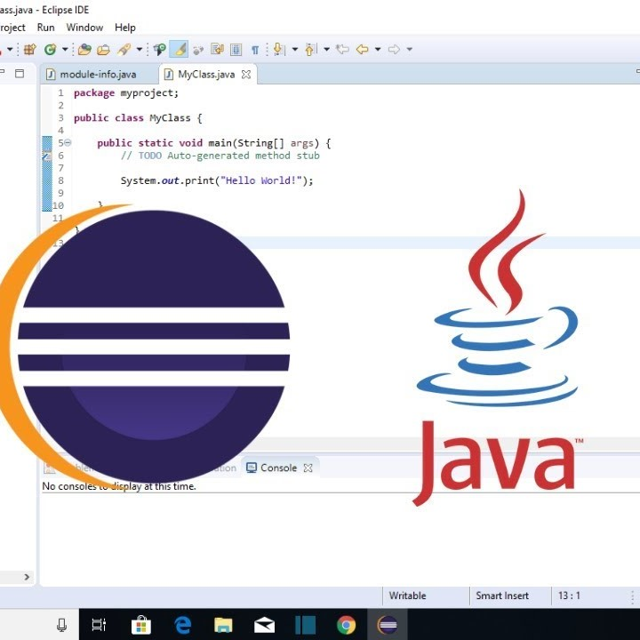

As our final project for ICS 111, my group and I created a game in Eclipse IDE where a player-controlled character must collect items to win and simultaneously avoid moving obstacles. Additionally, we programmed the obstacles to occasionally get the player's location and move toward it. After completing the project, we presented it to our class.

This was my first project and my first introduction into computer science. I learned the basics of programming and Java using the Eclipse IDE as well as what it is like to work on a program with others. I enjoyed this project and this class as I was able to express my creativity through programming and eventually spark my interest in computer science.
