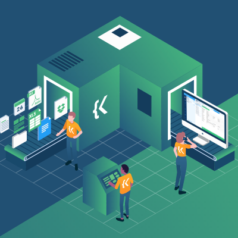

For my ICS 212 project, I created a database in C that holds records of information. Using the console as a UI, the user can insert and delete records or change information in a record. Towards the end of the semester, I had to convert the project into C++, which was one of the most difficult aspects of the project.

This project was my most difficult thus far as it encompasses all of my knowledge of C and C++ and gave me an idea of how programmers work on big projects. However, I learned a lot about program organization paradigms, programming environments, implementation of a module from specifications, and the C and C++ programming languages.

ICS 212 was arguably my greatest obstacle up until that point in my academic career. This course and the professor, Ravi Narayan, challenged me to think critically and emphasized problem solving rather than expecting all the answers to be laid out for me. In addition to learning the programming languages C and C++, we dove deeper into how our computers actually work. More specifically, we spent a lot of time learning about how memory works and tracing code in order to fully understand the code we wrote. And while my peers and I dreaded it, I am personally grateful to have overcome this obstacle because I am now another step closer to becoming a competent computer scientist.
